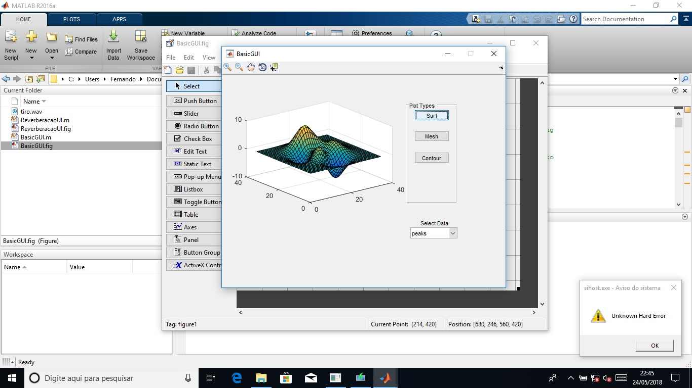
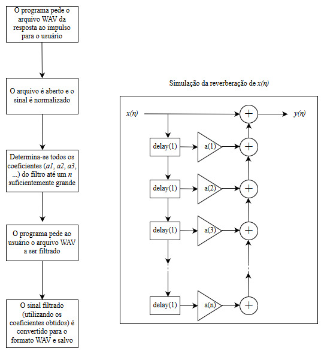
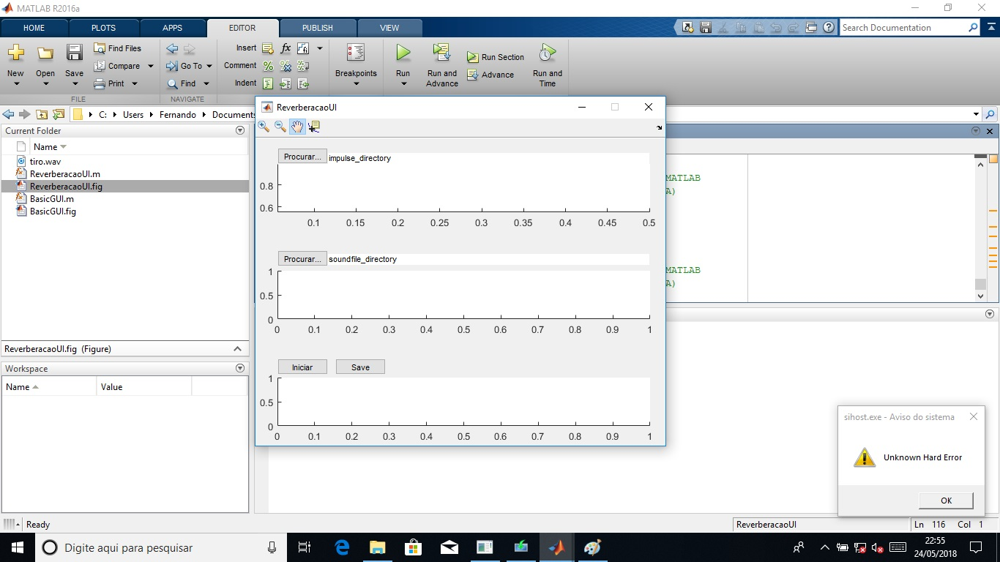

# koiti_reverberacao

Esse projeto tem como objetivo simular o fenômeno da reverberação de um sinal acústico. Para isso, utilizaremos o MATLAB R2016a. O projeto, no entanto, não se aprofunda na teoria da acústica. Em vez disso, utilizaremos classes e funções prontas da Mathworks.

**EXECUÇÃO DE TUTORIAL**

O tutorial realizado foi o seguinte: [https://www.mathworks.com/videos/creating-a-gui-with-guide-68979.html]

O objetivo do tutorial foi programar uma interface capaz de plotar diferentes dados (peaks, membrane e sinc) de três diferentes maneiras (surf, mesh e contour). Com isso, pôde-se aprender o básico da interface GUIDE do MATLAB.

O resultado final do tutorial pode ser observado nas imagens abaixo:

Nessas imagens, pode-se observar o APP totalmente funcional, sendo inclusive possível usar as ferramentas Zoom in, Zoom Out, Pan, Rotate e Data Cursor.

**USER INTERFACE**

O fluxograma utilizado como base para a interface foi o seguinte:

Assim, com as ferramentas apreendidas no tutorial, foi possível montar a interface não funcional do programa.

A interface possui somente 4 pushbuttons. Esses pushbuttons terão a função de pedir ao usuário o arquivo da amostra de impulso e o arquivo a ser filtrado, outro para iniciar a simulação e outro para salvar o arquivo sonoro obtido.

Além disso, a cada vez que o usuário insere um arquivo sonoro ou realiza uma simulação, o gráfico do arquivo é plotado.

Fernando Koiti Tsurukawa

Instituto Militar de Engenharia

Eng. de Telecomunicações - 3º ano
