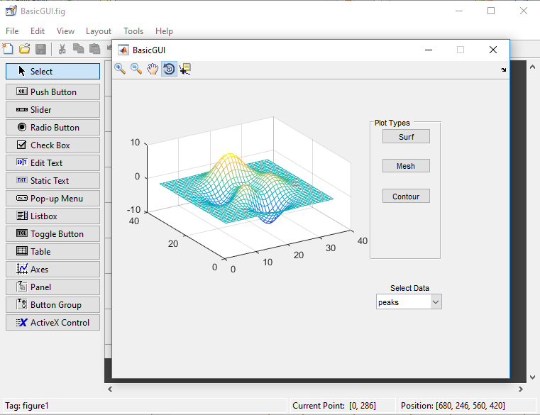
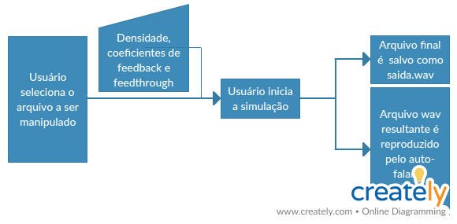
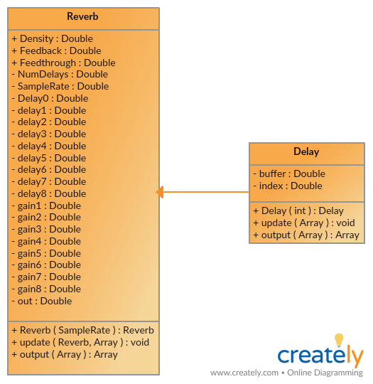
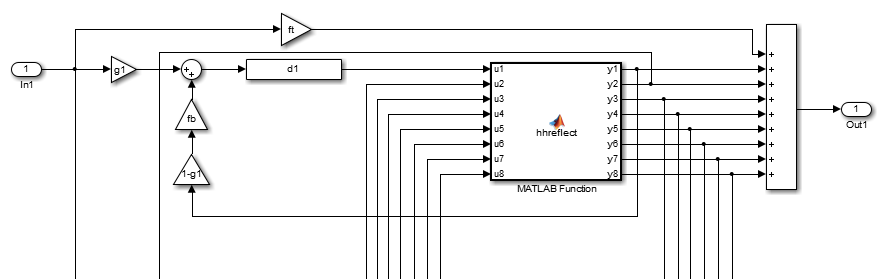
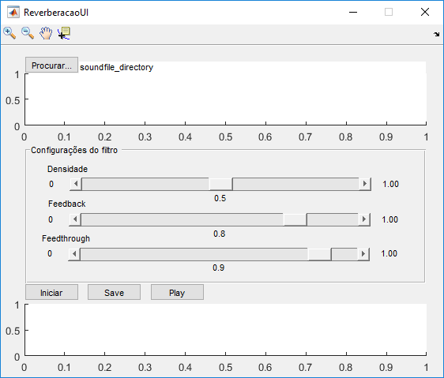
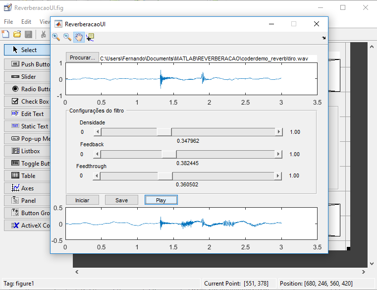

# koiti_reverberacao
## INTRODUÇÃO

Esse projeto tem como objetivo simular o fenômeno da reverberação de um sinal acústico. Para isso, utilizaremos o *MATLAB R2016a*. O projeto, no entanto, não se aprofunda na teoria da acústica. Em vez disso, utilizaremos classes e funções prontas da Mathworks.

## EXECUÇÃO DE TUTORIAL

O tutorial realizado foi o seguinte: [https://www.mathworks.com/videos/creating-a-gui-with-guide-68979.html]

O objetivo do tutorial foi programar uma interface capaz de plotar diferentes dados (peaks, membrane e sinc) de três diferentes maneiras (surf, mesh e contour). Com isso, pôde-se aprender o básico da interface [GUIDE](https://www.mathworks.com/discovery/matlab-gui.html) do *MATLAB*.

O resultado final do tutorial pode ser observado na imagem abaixo:

Nessas imagens, pode-se observar o app do tutorial totalmente funcional, sendo inclusive possível usar as ferramentas Zoom in, Zoom Out, Pan, Rotate e Data Cursor.

## FLUXOGRAMA

## DIAGRAMA DE CLASSES

## DIAGRAMA DA FUNCIONAMENTO

As classes e funções utilizadas (*Reverb.m*, *hhreflect.m*, *Delay.m* e *get_prime.m*) foram obtidas do seguinte [link](https://www.mathworks.com/help/coder/examples/reverberation-using-matlab-classes.html).

A função responsável por manipular o input sonoro adicionando delays à entrada é a *hhreflect*, a qual recebe um vetor e retorna um vetor, cujo funcionamento é descrito pelo seguinte diagrama:

> The diagram shows only the first delay line. Imagine another seven delay lines being repeated in the diagram but each delay line has an individual delay and associated feedback gain block. The Householder reflection (i.e. hhreflect function) is essentially mixing/permuting the signals without changing the energy of the total signal. Therefore, we are essentially duplicating the incoming signal and feeding it back with small time displacements. The result is a reverberation effect.

A classe *Reverb* recebe como input uma frequência de amostragem e possui como atributos públicos **Density, Feedback e Feedthrough**, que são coeficientes para determinar a magnitude das reflexões sonoras, isto é, são os valores que multiplicam os output das funções *hhreflect* e *delay*, respectivamente.

## INTERFACE VISUAL

A interface conta com 4 pushbuttons: 

1. *(Procurar...)* Para que o usuário insira o arquivo WAV em que deseja fazer a simulação.
2. *(Iniciar)* Para que o usuário inicie a simulação.
3. *(Save)* Para salvar o arquivo WAV produzido.
4. *(Play)* Para tocar o áudio produzido.

Para controlar os parâmetros da simulação, há 3 sliders para controlar os três atributos da classe Reverb.m.

Além disso, a cada vez que o usuário insere um arquivo sonoro ou realiza uma simulação, o gráfico do arquivo é plotado.

## INSTALAÇÃO

Basta executar o arquivo **MyAppInstaller_mcr.exe** e seguir as instruções do instalador.

O arquivo MyAppInstaller_mcr.exe se encontra na aba **Releases**. 

## INSTALAÇÃO ALTERNATIVA

1. Baixar os arquivos da pasta *for_testing*;
2. Instalar o *MATLAB Runtime 9.0.1* (correspondente ao MATLAB 2016a) conforme é explicado no arquivo *readme.txt*;
3. Rodar o arquivo Reverberator.exe.

## POSSIBLE ISSUES
* O programa não consegue encontrar arquivos WAV fora da pasta do programa, dando erro se o usuário escolher um arquivo fora dessa pasta.

Fernando Koiti Tsurukawa\
Instituto Militar de Engenharia\
Eng. de Telecomunicações - 3º ano
